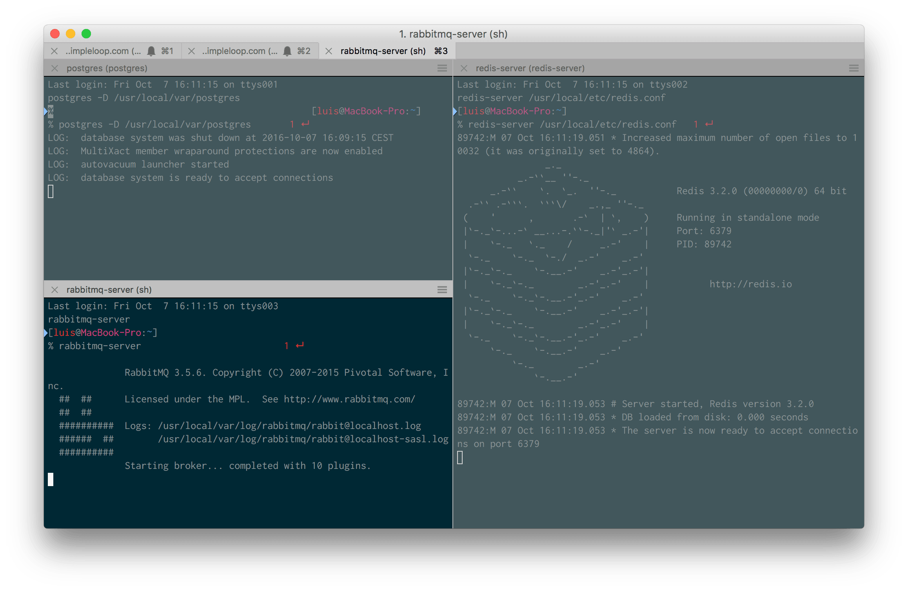
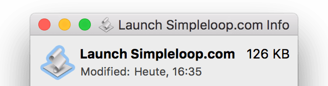
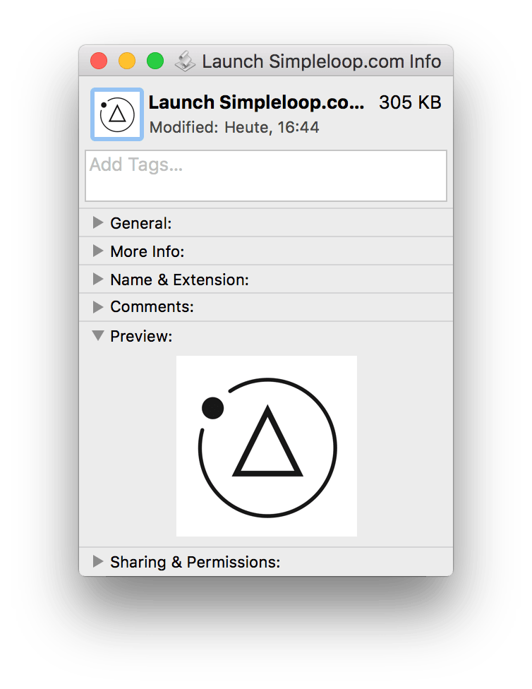

# 🚀 iterm-project-launcher
🐰 Quicklauncher for your projects using AppleScript and [iTerm2 v3](https://www.iterm2.com/version3.html).

At Simpleloop, most of our projects require different services to be run,
because we don't do typical web projects with just a database and some PHP
(Python ftw!). Remembering if a project required redis or memcached and
rabbitmq to run is quite a pain. Why not automate?


## Requirements
* 🍎 AppleScript v2.0+ (OSX 10.5+, macOS Sierra+)
* 🖥  [iTerm2 v3.0+](https://www.iterm2.com/version3.html)


## Files
* `quicklaunch.applescript`  
  A simple text file containing the AppleScript. You want this if you don't
  have any Apple Script Editor at hand.
* `quicklaunch.scpt`  
  A compiled script file. One can only open this with the Apple Script Editor.


## How To
1. Clone the repository and open up `quicklaunch.scpt` in the *Script Editor*
   shipped with your macOS.
2. Note the first few lines inside the script. Change these to the commands you
   would typically enter to manually boot up a project and it's services:

    ```applescript
    --- The tabs to create. Each tab can either run a command, or
    --- split (v)ertically/(h)orizontally and run a command in that split
    --- You can see the resulting iTerm screenshotted further down the page.
    set termCommands to {¬
        --- Each item in here represents a tab
        --- This here would simply go to the project folder.
        {command:"workon simpleloop"}, ¬
        --- This would also switch to my project folder and execute `gulp serve`
        {command:"workon simpleloop && gulp watch"}, ¬
        --- This is another tab. But it has special super cow powers...
        {splits:{¬
            --- ...because it can do splits! (not in the JCVD sense)
            --- "v" creates a vertical splits (this would run postgres and redis
            --- a separate vertical splits)
            {command:"postgres -D /usr/local/var/postgres", splitType:"v"}, ¬
            {command:"redis-server /usr/local/etc/redis.conf", splitType:"v"}, ¬
            --- "h" a horizontal split
            {command:"rabbitmq-server", splitType:"h"} ¬
                } ¬
            } ¬
            }
    ```

    (…indentation sucks with the Script Editor. Also I would have loved to
    add these comments inside the script, but AppleScript does not allow
    comments in data structure definitions…).

    Note the weird `¬` character at the end of each line. AppleScript does not
    support breaking expressions into multiple lines via a regular newline,
    instead it uses this character to mark that. You can insert that character
    by pressing `ALT+L` in the Script Editor.
3. Now go to `File`, hit `Export`.
4. In the appearing dialogue, set the fileformat to `Application`.
5. Give it a nice name (`Launch Simpleloop.com` in this very case), put it into
   your *Applications* folder and hit `Save`!
6. Simply double click the resulting `.app`. Note that
   [Alfred](https://www.alfredapp.com/) also adds this to it's index. Hence, if
   you use it (and you really should), you can even boot up your projects
   nicely via Alfred (without needing the Powerpack 💰).

That's what our example here looks like (3 Tabs: first ones in my project
folder, the last one with 3 splits running postgres, redis and rabbitmq):




## Bonus: Changing the Launcher Icon
[Loving this](https://support.apple.com/kb/PH13922) since my father showed it
to me in the mid 90s:

1. Open up any picture you want using Preview.
2. Select all and copy.
3. Locate your Launcher's `.app` and open up the Information window (`CMD+i`).
4. Click on the bigger icon in the top right. It should now have a glow around
   it:
   
5. Paste! And `boom clap raise your fist`:
   


## Bonus: Development Tips
Apple's Script Editor is OK, but you should really use something more capable
like XCode or [Script Debugger by Late Night Software](http://latenightsw.com/).

One nice thing is that you don't have to care too much about indentation, as
the compile process (manually triggered by `CMD+k`) formats everything nicely.

Also, make good use of the included `toString()` subroutine.
